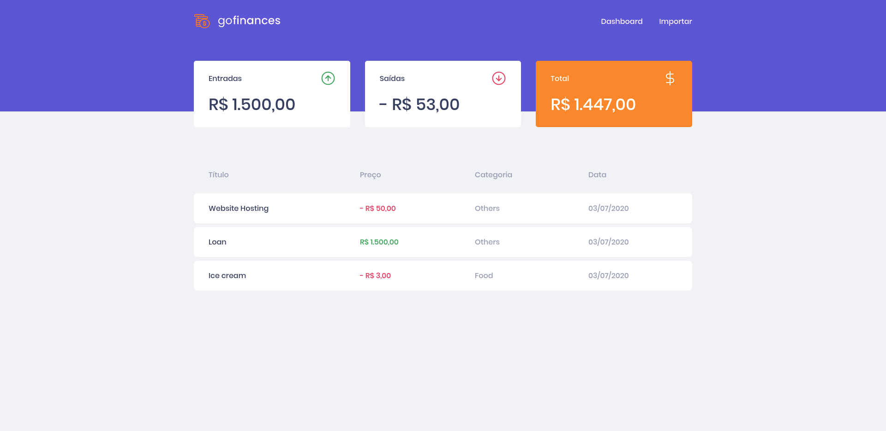

<h1 align="center">
  
</h1>

<h3 align="center">
  Um simples Web App de controle financeiro desenvolvido com ReactJS 
</h3>

# Índice

- [Sobre](#sobre)
- [Screenshots](#screenshots)
- [Tutorial](#tutorial)
- [Stack](#tecnologias-utilizadas)
- [Configurando o Ambiente de Desenvolvimento](#como-usar)
- [Contribua](#como-contribuir)

<a id="sobre"></a>

## :bookmark:  Sobre

O <strong>[Go Finances](https://jimmybastos.github.io/gofinances/) 📲</strong> é uma aplicação Web que permite gerenciar operações financeiras, além de importar transações no formato CSV.

<a id="screenshots"></a>

## :heart_eyes: Screenshots
<details>
  <summary>
    Visualizar layout
  </summary>
  
</details>

<a id="tecnologias-utilizadas"></a>

## :rocket: Stack

Esta aplicação foi desenolvida com as seguintes tecnologias:

- [TypeScript](https://www.typescriptlang.org/)
- [ReactJS](https://reactjs.org/)
- [React Router DOM](https://reacttraining.com/react-router/)
- [React Icons](https://react-icons.netlify.com/#/)
- [Styled Components](https://styled-components.com/)
- [Axios](https://github.com/axios/axios)
- [Eslint](https://eslint.org/)

<a id="como-usar"></a>

## :fire:  Configurando o Ambiente de Desenvolvimento

- ### **Pré-requisitos**

  - É **necessário** possuir o **[Node.js](https://nodejs.org/en/)** instalado na máquina
  - Também, é **preciso** ter um gerenciador de pacotes, se você já tem o Node.js, então o **[NPM](https://www.npmjs.com/)** já vai estar disponível.
  - Por fim, é **essencial** seguir as intruções para instalar **[Expo](https://expo.io/)**

1. Faça um clone :

```sh
  $ git clone https://github.com/JimmyBastos/github-explorer.git
```

2. Executando a Aplicação:

```sh
  # Execute o comando abaixo para instalar as dependencias do projeto
  $ yarn

  # Inciciar o servidor de desenvolvimento
  $ yarn start

  # Construir uma build para produção
  $ yarn build
```

<a id="como-contribuir"></a>

## :heavy_check_mark: Como Contribuir

- Faça um Fork desse repositório

- Clone o repositório
```sh
  $ git clone https://github.com/<SEU_USUARIO_GIT>/little-friend.git
```
- Crie um branch com sua feature: `git checkout -b nome-da-feature`

- Comite suas mudanças: `git commit -m 'feat: Breve descrição da feature'`

- Envie a feature: `git push origin nome-da-feature`

## :computer: Author

<table>
  <tr>
    <td align="center">
      <a href="https://www.linkedin.com/in/jimmybastos/">
        
        <br />
        <sub>
          <b>@Jimmy Bastos</b>
        </sub>
       </a>
    </td>
    <td align="center">
      <a href="https://www.linkedin.com/school/rocketseat/">
        
        <br />
        <sub>
          <b>@Rocketseat</b>
        </sub>
       </a>
    </td>
  </tr>
</table>

## :memo:  License

Esse projeto está sob a licença MIT. Acesse o arquivo [LICENSE](LICENSE) para mais detalhes.

